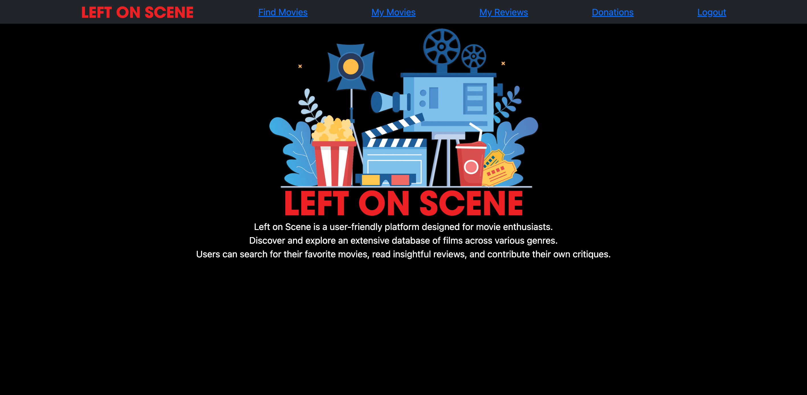
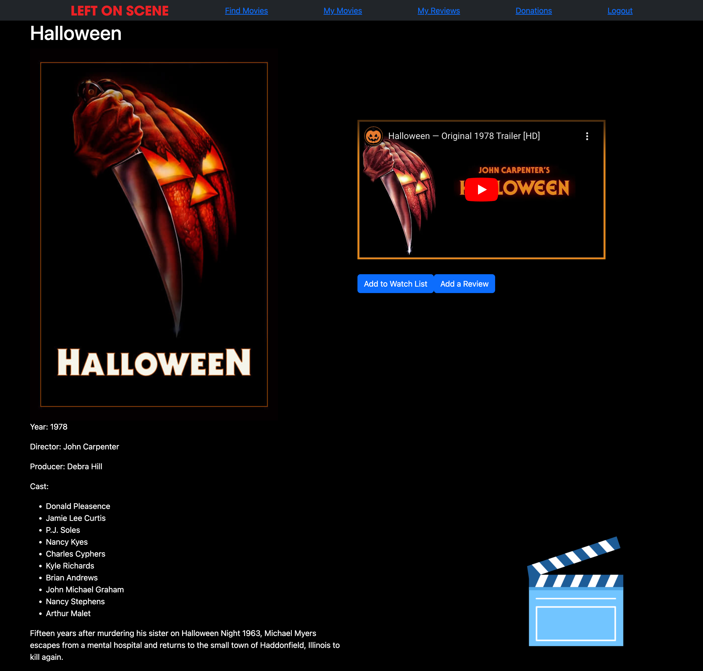

# project-3
Project-3-challenge

## Left On Scene Search page

* AS a movie

* I WANT to be able to create a page where the user can search for their favorite movie and get a list of movies, that will include the film details and a trailer

* SO THAT the user can add to a favorite list and be able to leave a review that can be viewed by other users.  

## Acceptance Criteria

* GIVEN a command-line application that accepts user input

* WHEN I start the application

* THEN the user is presented with the homepage that allows the user to create a account, sign in to their account or leave a donation for the webmaster creators. 

* WHEN the user searches for their favorite movie

* THEN the user is presented with a list of movies with that name.

* WHEN the user clicks the movie poster they are taken to the movie page.

* THEN the user can see a trailer, add to the favorites and / or leave a review of the movie. 

* WHEN the user adds to the favorite list or writes a review, other users will see the review and the user will view their favorites. 

## Resources

* W3schools.org

* Code Academy

* YouTube videos for coding help

* GitHub 

* Stackoverflow to answer questions on coding

* Tutoring sessions

* Google search 

## Assets

